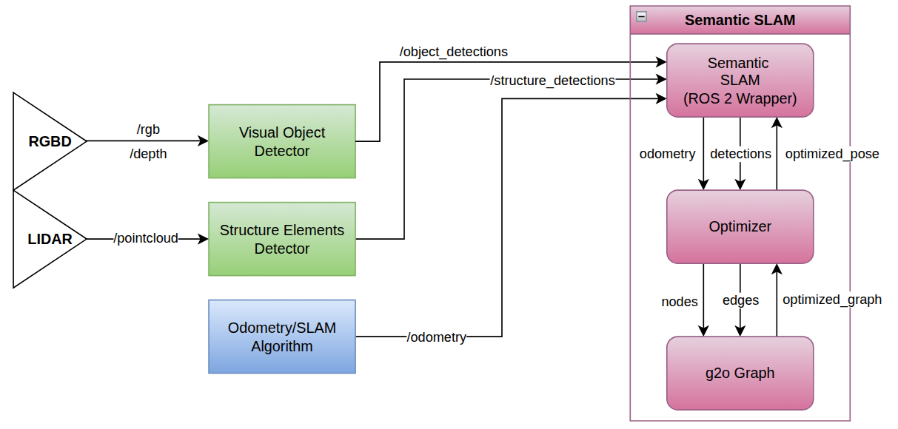

# SHEREC Project: Semantic SLAM

This repository contains deliverable **D2.4: SLAM Software** for the [SHEREC project](https://www.sherecproject.com/).

The software provides a modular **Semantic SLAM system** for estimating a drone’s pose while navigating inside ship environments.

It has been developed within **Work Package 2: Aerial Drone Development**, specifically under **Task T2.5: Semantic SLAM**, led by the **Computer Vision and Aerial Robotics group (CVAR)** at **Universidad Politécnica de Madrid**, with contributions from the **Paderborn University** and **SINTEF**.

## ⚙️ Overview

Within SHEREC, this module provides the **drift-corrected localization and semantic mapping** layer that the drone relies on while inspecting a ship's interior. It is implemented as a ROS 2 node (Aerostack2) and runs **online and onboard** on the drone's embedded computer.

<p align="center">
  
</p>

It fuses two kinds of information in a **dual pose-graph** (built on `g2o`):

- **Odometry** — from any source published as `nav_msgs/Odometry` (e.g. LiDAR-inertial odometry or VIO), providing the high-frequency relative motion estimate.
- **Semantic detections** — *structural elements* (walls, rooms) from the LiDAR structural detector and *objects* (doors, cabinets, pipes, equipment) from the RGB-D visual object detector (Task T2.4). These are received as detection messages and used as landmark constraints.

The pipeline works as follows:

1. Between main-graph keyframes, a **temporary graph** accumulates the high-frequency detections of each landmark.
2. On each new keyframe, the temporary graph is optimized and the multiple observations of every landmark are **distilled into a single refined constraint**, which is promoted to the long-lived **main graph** (re-observing a known landmark acts as an implicit loop closure). This keeps the graph compact while preserving detection information.
3. From the optimized trajectory, the node computes and continuously broadcasts the **`map` → `odom` transform** to the TF tree, so every other module in the stack receives a globally consistent, drift-corrected pose.

**Outputs for the project:** the drift-corrected pose used by navigation, a semantically enriched map of the ship interior, and the recorded LiDAR point-cloud map that is passed to **WP6** as input for generating the Ship Recycling Plan (SRP).

## 🚀 Usage

The system can be tested using the provided Docker setup, which runs the full pipeline — the [Semantic SLAM architecture](https://github.com/perezsaura-david/dps_slam) together with the [lidar-based structural detection](https://gitlab.com/cvar-upm/release/lidar-bev-structural-detector) — inside a self-contained image.

The integration of the visual object detection front-end will be included in the future.

See [`docker/README.md`](docker/README.md) for the step-by-step instructions (building the image and launching the pipeline).

> 📂 **Datasets:** sample datasets for testing the pipeline will be made available soon.

## 🔗 Related Repositories

- **SLAM Architecture (DPS-SLAM)**  
  https://github.com/perezsaura-david/dps_slam
- **LiDAR-BEV Structural Detector**  
  https://gitlab.com/cvar-upm/release/lidar-bev-structural-detector
- **General Visual Object Detector and Pose Estimator**  
  (Under development)
- **Flight-ready Drift-Aware LiDAR-Intertial Odometry and Mapping with Self-correcting Maps**  
  https://github.com/alvgaona/fr-lio
  

## 📖 Papers <a id="published-papers"></a>

<details>
<summary><a href="https://arxiv.org/abs/2604.15168">
Dual Pose-Graph Semantic Localization for Vision-Based Autonomous Drone Racing
</a></summary>

```bibtex
@misc{perezsaura2026dualposegraphsemanticlocalization,
  title={Dual Pose-Graph Semantic Localization for Vision-Based Autonomous Drone Racing}, 
  author={David Perez-Saura and Miguel Fernandez-Cortizas and Alvaro J. Gaona and Pascual Campoy},
  year={2026},
  eprint={2604.15168},
  archivePrefix={arXiv},
  primaryClass={cs.RO},
  url={https://arxiv.org/abs/2604.15168},
}
```

</details>
<!-- This paper has been accepted to the IEEE International Workshop on Metrology for Aerospace (MetroAeroSpace) 2026. -->

<details>
<summary><a href="https://arxiv.org/abs/2603.19830">
Real-Time Structural Detection for Indoor Navigation from 3D LiDAR Using Bird's-Eye-View Images
</a></summary>

```bibtex
@article{li2026real,
  title={Real-Time Structural Detection for Indoor Navigation from 3D LiDAR Using Bird's-Eye-View Images},
  author={Li, Guanliang and Espinosa-Angulo, Pedro and Perez-Saura, David and Tapia-Fernandez, Santiago},
  journal={arXiv preprint arXiv:2603.19830},
  year={2026}
}
```

</details>
